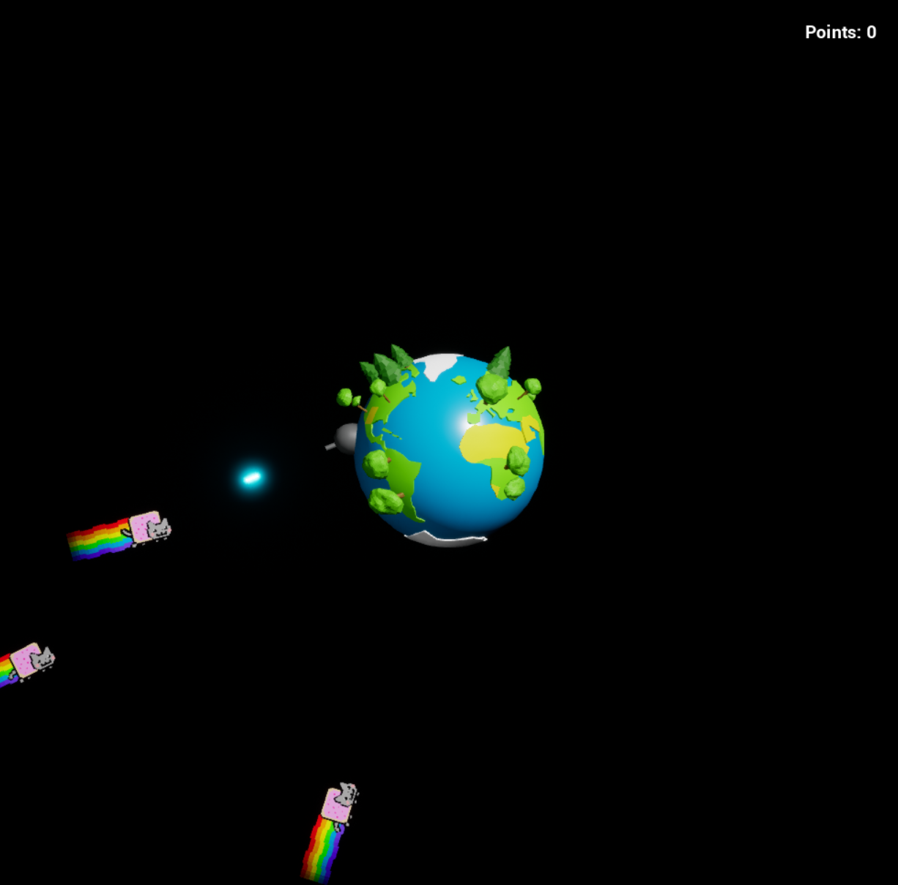

# SpaceMcShooty
Shoot Space Cats, earn points, buy amazing upgrades and protect the Earth with bazillion bullets from the evil invaders!
SpaceMcShooty is a game I have created in 2 days in Unreal Engine for Epic MegaJam 2019.

The game is available at [itch.io](https://an0num0us.itch.io/spacemcshooty)

# Gameplay Instructions
A/D - move
Left Mouse Button - shoot
Spacebar - pause game and open menu
1, 2, 3, 4 - purchase upgrades (may be used even when the game is not paused)
9 - (cheat) set prices of all upgrades to 0
R - restart (available when the game is paused)
Esc - quit game (available when the game is paused)

# Credits
- Music [Haunted by Shirk](https://www.newgrounds.com/audio/listen/581125)
- Laser sounds and cat meowing from [freesound.org](https://freesound.org/)

# Special Thanks
- [Marcell "Martty" Kiss](https://github.com/martty) form programming assistance, playtesting and feedback
- [Stanislaw "Zero" Lifar](https://www.deviantart.com/zerostas) for animating Nyan Cat and playtesting the game